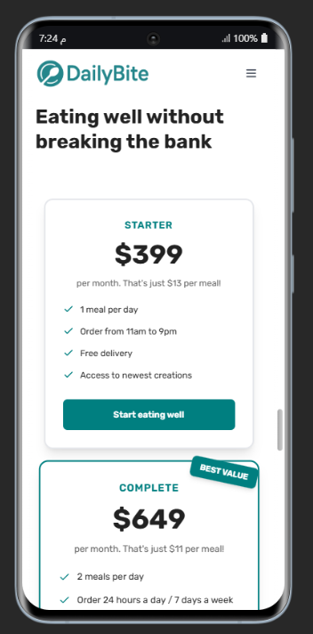

# 🍽️ DailyBite - AI-Powered Meal Delivery Landing Page

<div align="center">
  
  
  **A modern, responsive landing page for DailyBite - the smart 365-days-per-year food subscription service that makes healthy eating effortless.**

[](https://reactjs.org/)
[](https://vitejs.dev/)
[](https://tailwindcss.com/)
[](https://opensource.org/licenses/MIT)

</div>

## 🌟 Overview

DailyBite is a beautifully crafted, fully responsive landing page for an AI-powered meal delivery service. Built with modern web technologies, it showcases how AI can personalize nutrition and make healthy eating accessible to everyone.

### ✨ Key Features

-   🎨 **Modern Design**: Clean, professional UI with a cohesive teal color scheme
-   📱 **Fully Responsive**: Optimized for all devices from mobile to desktop
-   ⚡ **Performance Optimized**: Built with Vite for lightning-fast loading
-   🎯 **Conversion Focused**: Strategic layout designed to drive sign-ups
-   🔧 **Developer Friendly**: Clean code architecture and comprehensive documentation
-   🌐 **Accessibility**: Built with semantic HTML and accessibility best practices

## 🚀 Live Demo

[View Live Demo](https://Yous2ef.github.io/daily-bite/)

## 📸 Screenshots

<div align="center">
  
  <br/>
  <em>Hero Section with Call-to-Action</em>
</div>

<details>
<summary>View More Screenshots</summary>

| Section  | Desktop                                                      | Mobile                                                     |
| -------- | ------------------------------------------------------------ | ---------------------------------------------------------- |
| Features |  |  |
| Pricing  |    |    |
| Contact  |    |    |

</details>

## 🛠️ Tech Stack

-   **Frontend Framework**: React 19.1.1
-   **Build Tool**: Vite 7.1.0
-   **Styling**: TailwindCSS 4.1.11 + Custom CSS
-   **Icons**: Lucide React 0.537.0
-   **Code Quality**: ESLint with React plugins
-   **Package Manager**: npm

## 📦 Installation & Setup

### Prerequisites

-   Node.js (v18.0.0 or higher)
-   npm (v8.0.0 or higher)

### Quick Start

1. **Clone the repository**

    ```bash
    git clone https://github.com/yourusername/dailybite-landing-page.git
    cd dailybite-landing-page
    ```

2. **Install dependencies**

    ```bash
    npm install
    ```

3. **Start development server**

    ```bash
    npm run dev
    ```

4. **Open your browser**
   Navigate to `http://localhost:5173`

### Build for Production

```bash
# Build the project
npm run build

# Preview the production build
npm run preview
```

## 📁 Project Structure

```
src/
├── assets/              # Images, logos, and static assets
│   ├── app/            # App screenshots
│   ├── customers/      # Customer photos
│   ├── gallery/        # Food gallery images
│   ├── logos/          # Brand logos
│   ├── meals/          # Meal photos
│   └── index.js        # Asset exports
├── components/         # Reusable UI components
│   ├── Button.jsx      # Custom button component
│   ├── Footer.jsx      # Site footer
│   ├── Nav.jsx         # Navigation component
│   └── index.js        # Component exports
├── sections/           # Page sections
│   ├── Hero.jsx        # Hero section
│   ├── Features.jsx    # Featured logos
│   ├── HowItWork.jsx   # How it works steps
│   ├── Meals.jsx       # Meal showcase
│   ├── Testimonials.jsx # Customer testimonials
│   ├── Pricing.jsx     # Pricing plans
│   ├── Contact.jsx     # Contact form
│   └── index.js        # Section exports
├── constants/          # Static data and constants
│   └── index.js        # App data (testimonials, pricing, etc.)
├── index.css          # Global styles and CSS variables
├── App.jsx            # Main app component
└── main.jsx           # Entry point
```

## 🎨 Design System

### Color Palette

```css
:root {
    --primary-color: #25878b; /* Teal primary */
    --primary-hover-color: #1b777a; /* Darker teal */
    --bg-color: #e2ebea; /* Light background */
    --color-black: #333; /* Dark text */
    --white: #ffffff; /* Pure white */
    --light-bg: #fdf2e9; /* Light accent background */
    --text-secondary: #555; /* Secondary text */
    --text-muted: #767676; /* Muted text */
}
```

### Typography

-   **Primary Font**: Rubik (Clean, modern sans-serif)
-   **Fallback Fonts**: Cairo, Noto Kufi Arabic, Roboto
-   **Accent Font**: Sacramento (Script font for special elements)

### Component Guidelines

-   **Buttons**: Consistent padding, hover effects, and transitions
-   **Cards**: Subtle shadows with hover animations
-   **Forms**: Clean inputs with focus states
-   **Images**: Optimized aspect ratios and loading states

## 📱 Responsive Design

The landing page is built with a mobile-first approach:

-   **Mobile**: 320px - 768px
-   **Tablet**: 768px - 1024px
-   **Desktop**: 1024px+
-   **Large Desktop**: 1440px max-width container

## 🧩 Key Components

### Navigation (`Nav.jsx`)

-   Sticky navigation with scroll effects
-   Mobile hamburger menu
-   Smooth scroll to sections

### Hero Section (`Hero.jsx`)

-   Compelling headline and value proposition
-   Dual CTA buttons
-   Customer social proof with avatars

### Pricing (`Pricing.jsx`)

-   Two-tier pricing strategy
-   Feature comparison
-   Highlighted popular plan

### Contact Form (`Contact.jsx`)

-   Lead generation form
-   Form validation
-   Attractive gradient design

## 🎯 Performance Optimizations

-   **Image Optimization**: WebP format with fallbacks
-   **Code Splitting**: Dynamic imports for better loading
-   **CSS Optimization**: Critical CSS inlined
-   **Bundle Analysis**: Optimized chunk sizes
-   **Lazy Loading**: Images and components loaded on demand

## 🔧 Customization

### Changing Colors

Update the CSS variables in `src/index.css`:

```css
:root {
    --primary-color: #your-color;
    --primary-hover-color: #your-hover-color;
    /* Update other variables as needed */
}
```

### Adding New Sections

1. Create a new component in `src/sections/`
2. Export it from `src/sections/index.js`
3. Import and add to `src/App.jsx`

### Modifying Content

Update the data in `src/constants/index.js`:

```javascript
export const testimonials = [
    // Your testimonial data
];

export const pricingPlans = [
    // Your pricing data
];
```

## 📝 Available Scripts

| Command           | Description              |
| ----------------- | ------------------------ |
| `npm run dev`     | Start development server |
| `npm run build`   | Build for production     |
| `npm run preview` | Preview production build |
| `npm run lint`    | Run ESLint               |

## 🤝 Contributing

We welcome contributions! Please follow these steps:

1. **Fork the repository**
2. **Create a feature branch**
    ```bash
    git checkout -b feature/amazing-feature
    ```
3. **Commit your changes**
    ```bash
    git commit -m 'Add some amazing feature'
    ```
4. **Push to the branch**
    ```bash
    git push origin feature/amazing-feature
    ```
5. **Open a Pull Request**

### Development Guidelines

-   Follow the existing code style
-   Add comments for complex logic
-   Test on multiple devices/browsers
-   Update documentation for new features
-   Ensure accessibility compliance

## 🐛 Bug Reports & Feature Requests

Found a bug or have a feature idea? Please open an issue:

1. Check existing issues first
2. Use the appropriate issue template
3. Provide detailed reproduction steps
4. Include screenshots when helpful

## 📄 License

This project is licensed under the MIT License

## 👨‍💻 Author

**Your Name** - [GitHub](https://github.com/Yous2ef) | [LinkedIn](https://www.linkedin.com/in/youssefmahmoud-yma/)


## 📊 Project Stats


---

<div align="center">
  <p>Made with ❤️ for the open source community</p>
  <p>If you found this project helpful, please consider giving it a ⭐!</p>
</div>
